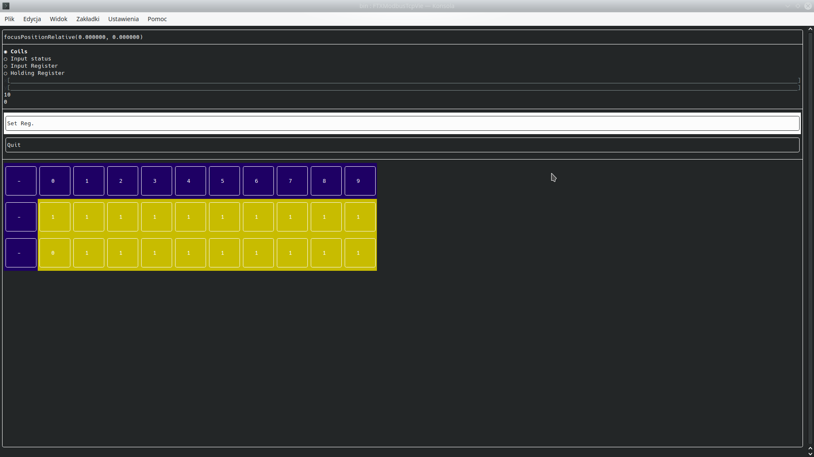

# FTXModbusTcpViewer
Very easy viewer for modbus. <b> PROGRAM WAS TESTED USING PYMODUS. NO WARRANTY IS WORKING WITH OTHER SOFTWARE</b>.
Program is able to read and write registers from modbus server and show them on screen.

# Build
Program is working only on Linux.
run build script:

```
./build.sh
```

After build go to bin folder. If build was successful you can run software in that way:

```
./FTXModbusTcpViewer
```

# Configuration
In file configuration.json you can find configuration of the program.
This file is copied to bin folder by build script:
In configuration(who is json file) we can find three main parts:
- register-interval
  This part is saying where is beginning/end address of modbus register. For example coils-star: 0 is saying that 
  we're starting read from coils from address 0, coils-end: 20 says that we stop reading on address 20. That means 
  we read 21 addresses.
- network-configuration.
  Simply network configuration for modbus server what we want to connect.
- view-configuration.
  We can manipulate view output. Currently, we can only change number of displayed rows.

All changes in configuration required restart of program.

# FAQ
1) Q: On start of the program I see X in box values<br />
   A: That means that there is no connection with modbus server, check configuration file and server.
2) Q: In some point modbus server was shut down and application is frozen.
   A: Third party library for modbus connection is blocking in that case. You need to shut-down program.
3) Q: How to set modbus Register?
   A: Above button seg reg. there are two input fields. You need to click on them and type address in first field and value in second. <br />
      Be aware that in these fields' error messages are showing too.
  
